# CI/CD pipeline reference

This repository uses a small set of GitHub Actions workflows to cover code quality, security scanning, coverage, deployments, and repo automation.

## Workflow map

```mermaid
flowchart TD
  PushMain["push to `main`"] --> CI["`ci.yml`"]
  PushMain --> Coverage["`coverage.yml`"]
  PushMain --> CodeQL["`codeql.yml`"]
  PushMain --> Snyk["`snyk.yml`"]
  PushMain --> SDKE2E["`sdk-e2e-local-node.yml`"]
  PushMain --> Upptime["`upptime.yml`"]

  PullRequest["pull request events"] --> CI
  PullRequest --> Coverage
  PullRequest --> CodeQL
  PullRequest --> Snyk
  PullRequest --> PRTitle["`pr-title-lint.yml`"]
  PullRequest --> SyncIssues["`sync-issues.yml`"]
  PullRequest --> ProjectBoard["`project-board.yml`"]

  IssueLabel["issue labeled"] --> ProjectBoard
  IssueLabel --> SyncIssues
  Schedule["scheduled run"] --> CodeQL
  Schedule --> E2ENightly["`e2e-nightly.yml`"]
  Schedule --> Snyk
  Schedule --> Upptime

  WorkflowDispatch["manual dispatch"] --> Deploy["`deploy.yml`"]
  WorkflowDispatch --> Upptime
```



### Dependency notes

- There are no workflow-to-workflow `workflow_call` dependencies at the moment.
- Several workflows share the same trigger source, especially `push` to `main`, `pull_request`, and scheduled cron runs.
- `project-board.yml` and `sync-issues.yml` act on repository metadata rather than code changes.
- `deploy.yml` is intentionally manual and protected by GitHub Environments.

## Workflow reference

### `ci.yml`

- Trigger: `push` to `main` and every `pull_request`.
- Jobs:
  - `test`: runs `cargo test` for the Rust backend.
  - `build`: builds the contract for `wasm32v1-none`.
  - `lint`: runs `cargo clippy` and `cargo fmt --check`.
  - `node-tests`: runs the workspace JavaScript tests with `pnpm test`.
  - `node-coverage`: runs the JS test suite with coverage and checks for 80 percent minimum coverage.
  - `sdk-types-sync`: builds the contract spec and verifies `sdk/src/generated/types.ts` is up to date.
- Required secrets: none.
- Expected runtime: medium to long. The Rust and SDK type-sync jobs are the slowest parts, so a full run is usually 10 to 30 minutes depending on cache hits.
- Debugging tips:
  - Check whether the backend submodule was checked out. This workflow uses `submodules: recursive`.
  - For Rust failures, reproduce with `cargo test`, `cargo clippy`, or `cargo fmt --check` in the backend submodule.
  - For SDK sync failures, run `pnpm generate:types` and compare the generated file.
  - If PR comments are missing, remember the failure-comment step only runs on pull requests.

### `codeql.yml`

- Trigger: `push` to `main`, `pull_request` targeting `main`, and a weekly Sunday schedule at 02:00 UTC.
- Jobs:
  - `analyze`: initializes CodeQL for `javascript-typescript` and uploads the analysis results.
- Required secrets: none.
- Expected runtime: medium. Usually 10 to 20 minutes, but the weekly scan can take longer on a cold runner.
- Debugging tips:
  - Look for checkout or language-initialization failures first.
  - If CodeQL reports an analysis issue, reproduce locally by focusing on the JavaScript/TypeScript package that owns the file path.
  - Confirm the repository has Actions permissions to upload security events.

### `coverage.yml`

- Trigger: `push` to `main` and every `pull_request`.
- Jobs:
  - `coverage`: runs Rust coverage, SDK coverage, frontend coverage, and notifications coverage, then uploads the merged reports to Codecov.
- Required secrets:
  - `CODECOV_TOKEN`.
- Expected runtime: long. This is the heaviest workflow in the repo because it runs coverage across multiple packages and the Rust workspace; 20 to 45 minutes is a realistic range.
- Debugging tips:
  - Re-run each coverage command locally in the package that failed to see whether the issue is test logic or a threshold failure.
  - Check the generated `lcov.info` files if the Codecov upload fails.
  - Verify `CODECOV_TOKEN` is present in repository secrets and that the slug matches the Codecov project.

### `deploy.yml`

- Trigger: manual `workflow_dispatch`.
- Jobs:
  - `deploy`: deploys the contract to the selected network.
- Required secrets:
  - `TESTNET_DEPLOYER_SECRET`
  - `TESTNET_HORIZON_URL`
  - `MAINNET_DEPLOYER_SECRET`
  - `MAINNET_HORIZON_URL`
- Expected runtime: short to medium. Dry runs finish quickly; real deployments typically take a few minutes, depending on network responsiveness.
- Debugging tips:
  - Make sure the chosen environment exists in GitHub and has the required secrets.
  - If deployment fails, verify the Horizon URL and secret key for the selected network.
  - Use `dry_run: true` first when validating a new environment or script change.

### `e2e.yml`

- Trigger: `push` and `pull_request`.
- Jobs:
  - `e2e-tests`: starts a local Stellar node with Docker Compose, waits for RPC to come up, installs dependencies, and runs the end-to-end test suite.
- Required secrets: none.
- Expected runtime: medium. Usually 10 to 20 minutes, depending on Docker startup and test length.
- Debugging tips:
  - Confirm Docker and Docker Compose are available on the runner or local machine.
  - If the job appears to hang, inspect the local node logs and the `sleep 15` wait window.
  - Run `docker compose up -d` and `npm run test:e2e` locally to isolate test failures.

### `e2e-nightly.yml`

- Trigger: scheduled daily at 00:00 UTC.
- Jobs:
  - `e2e-tests`: same local node setup and end-to-end test run as `e2e.yml`.
- Required secrets: none.
- Expected runtime: medium. Similar to `e2e.yml`.
- Debugging tips:
  - Treat it the same as the regular E2E workflow.
  - If nightly runs fail but PR runs pass, compare environment drift, container image freshness, and Docker availability.

### `pr-title-lint.yml`

- Trigger: `pull_request` events on open, edit, reopen, and synchronize.
- Jobs:
  - `lint`: installs commitlint and checks the pull request title against Conventional Commits rules.
- Required secrets: none.
- Expected runtime: short. Usually under 1 minute.
- Debugging tips:
  - Fix the PR title to match the conventional format used in `commitlint.config.js`.
  - If the action fails during setup, check the Node.js version and whether npm can reach the registry.

### `project-board.yml`

- Trigger: issue label events and closed pull request events.
- Jobs:
  - `move-blocked`: moves issues labeled `blocked` into the Blocked view on the organization project board.
- Required secrets:
  - `PROJECT_PAT` is optional.
  - If `PROJECT_PAT` is not set, the workflow falls back to `GITHUB_TOKEN`.
- Expected runtime: short. Usually under 1 minute.
- Debugging tips:
  - Make sure the organization project exists and the Status field still has a `Blocked` option.
  - Check whether the issue is actually present on the project board before expecting the move to succeed.
  - If the workflow cannot update the board, the token may not have the right project permissions.

### `sdk-e2e-local-node.yml`

- Trigger: `push` to `main` and manual `workflow_dispatch`.
- Jobs:
  - `e2e-local`: checks out the repo, installs dependencies, starts a local Stellar node from `tests/e2e/docker-compose.yml`, waits for Horizon, runs SDK local-node e2e tests, and then tears the stack down.
- Required secrets: none.
- Expected runtime: medium. Usually 10 to 20 minutes.
- Debugging tips:
  - Verify the Docker Compose file still matches the ports the tests expect.
  - If Horizon never becomes reachable, inspect the container logs and the readiness loop.
  - Run `pnpm --filter @invoice-liquidity/sdk test:e2e-local` after starting the Docker stack locally.

### `snyk.yml`

- Trigger: `push` to `main`, `pull_request` targeting `main`, and a weekly Sunday schedule at 03:00 UTC.
- Jobs:
  - `snyk`: installs dependencies and runs `snyk test --all-projects --severity-threshold=high`.
- Required secrets:
  - `SNYK_TOKEN`.
- Expected runtime: medium. Usually 5 to 15 minutes.
- Debugging tips:
  - Re-run `pnpm install --frozen-lockfile` locally before blaming Snyk for dependency drift.
  - Confirm the token is configured in repository secrets.
  - If a package is missing from the scan, check that the workspace is still being picked up by `pnpm install` and the Snyk CLI.

### `sync-issues.yml`

- Trigger: issue label events.
- Jobs:
  - `sync-issues`: copies issues to the `ILN-Smart-Contract` repo when they are labeled `sync:smart-contract` or `sync:all`, copies them to `ILN-Frontend` when they are labeled `sync:frontend` or `sync:all`, and comments back with the sync destinations.
- Required secrets:
  - `GITHUB_TOKEN`.
- Expected runtime: short. Usually under 1 minute.
- Debugging tips:
  - Confirm the label names exactly match `sync:smart-contract`, `sync:frontend`, or `sync:all`.
  - Check that the target repos exist and are owned by the same organization.
  - If duplicates are created, remove and reapply the label only after confirming whether the target issue already exists.

### `upptime.yml`

- Trigger: `push` to `main`, a five-minute schedule, and manual `workflow_dispatch`.
- Jobs:
  - `summary`: updates the Upptime summary page.
  - `response-time`: records response time checks and can send Slack notifications.
  - `graphs`: refreshes monitoring graphs.
  - `static-site`: rebuilds the static status site.
- Required secrets:
  - `GITHUB_TOKEN`.
  - `NOTIFICATION_SLACK` for the `response-time` job if Slack notifications are enabled.
- Expected runtime: short to medium. Usually 2 to 10 minutes, but the frequent schedule means it may queue often.
- Debugging tips:
  - Check the upstream Upptime action logs first, since most failures come from generated file updates or repo permissions.
  - If the response-time job fails, verify the Slack webhook secret and the monitored endpoint availability.
  - Because it runs every five minutes, transient failures can be caused by overlapping runs or rate limits.

## Running checks locally

These commands mirror the checks used in CI as closely as practical:

```bash
git submodule update --init --recursive
pnpm install --frozen-lockfile
```

Rust backend checks:

```bash
cd backend
cargo test --target x86_64-unknown-linux-gnu
cargo build --target wasm32v1-none --release
cargo clippy
cargo fmt --check
```

JavaScript and TypeScript checks from the repo root:

```bash
pnpm test
pnpm test:coverage
pnpm generate:types
```

Package-specific coverage and test runs:

```bash
cd sdk
pnpm test:coverage
pnpm test:e2e-local

cd frontend
pnpm test -- --coverage

cd notifications
pnpm test -- --coverage
```

End-to-end local node flow:

```bash
docker compose -f tests/e2e/docker-compose.yml up -d
```

The `e2e.yml` workflow currently invokes `npm run test:e2e` after bringing up the local node. If that script is missing in your checkout, treat that as a workflow/package mismatch and inspect the package that is supposed to own the command before relying on the test result.

For the SDK local-node suite used by `sdk-e2e-local-node.yml`, run:

```bash
pnpm --filter @invoice-liquidity/sdk test:e2e-local
docker compose -f tests/e2e/docker-compose.yml down
```

PR title lint:

```bash
echo "docs: update ci cd reference" > /tmp/pr-title
npx commitlint --config commitlint.config.js --edit /tmp/pr-title
```

Security scans and code scanning are harder to reproduce exactly outside GitHub Actions, but you can still validate the project with the same package installs and test commands above before pushing.

## Failure triage checklist

1. Open the failed job and identify the first failing step, not the last one.
2. Re-run the equivalent command locally in the package that owns the failure.
3. Check repository secrets and environment protection if the job touches deployment, Snyk, or Codecov.
4. Confirm the backend submodule is initialized if any Rust step fails unexpectedly.
5. For issues that only happen on `main`, compare the branch history against the PR branch for lockfile or generated-file drift.
